# Additional App Store Compliance Info for the EU Digital Services Act

Updated: April 4, 2024 5:40 PM

Starting March, 2024 App Store developers who sell their apps either via Apple’s App Store or third-party app stores in the EU must provide 
additional information that will be displayed to customers.

Apple reference: 

[Manage European Union digital services act compliance information - App Store Connect - Help - Apple Developer](https://developer.apple.com/help/app-store-connect/manage-compliance-information/manage-european-union-digital-services-act-compliance-information)

App Store Connect started displaying the following warning in March 2024:

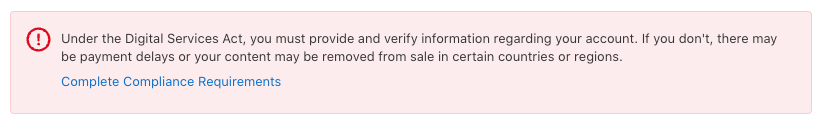

If you want to continue to make your apps available in the EU App Store you’ll need to provide (and have Apple ***verify***) customer-facing contact information. 

## What if I withdraw my apps from the EU, can I ignore this?

App Store Connect has always allowed you to individually select countries where your app will be made available. You absolutely can de-select all the countries in the EU, although you will have to find a complete and up-to-date list of those countries as there’s no “EU” checkbox. As per the UK government’s web site ([https://www.gov.uk/eu-eea](https://www.gov.uk/eu-eea)), the current list of EU countries is: Austria, Belgium, Bulgaria, Croatia, Republic of Cyprus, Czech Republic, Denmark, Estonia, Finland, France, Germany, Greece, Hungary, Ireland, Italy, Latvia, Lithuania, Luxembourg, Malta, Netherlands, Poland, Portugal, Romania, Slovakia, Slovenia, Spain and Sweden.

However, it’s not clear what happens even if you *do* remove your app’s availability from all EU countries via App Store Connect. It’s been reported that the Digital Services Act compliance warning continues to be displayed. Presumably this is an App Store Connect issue that will eventually be rectified.

### Information required if you are an organization

- The address associated with your *D-U-N-S Number* will automatically display (all businesses are automatically assigned a DUNS number)
- Phone number
- Email address

### Information required if you are an individual developer

- Address or P.O. Box
- Phone number
- Email address

## I don’t want to use my private home address or phone!

If you don’t want to use your home address (I certainly don’t!) it’s easy and cheap/free to setup a P.O. Box (and Apple permits their use) as an alternative to using your private home address. For example, I used UK Postbox ([ukpostbox.com](https://www.ukpostbox.com/)). If you don’t want to to use your private phone number you may wish to use a VoIP alternative, such as Google Voice.

### What you’ll need to complete the form

1. A contact **name** 
2. A contact **email** address
3. A contact **phone** number
4. A contact **address** or **PO Box**
5. **Documents** that prove the name and address provided are legitimate (if providing a PO Box you need to prove it’s associated with you)

### Steps required by an individual

Let’s assume you are an indie developer working from your home address. We’ll also assume you don’t want your home address, private phone number and email address displayed on the App Store!

The first hurdle that you’ll encounter when starting to provide DSA compliance information is the following trader/non-trader question:

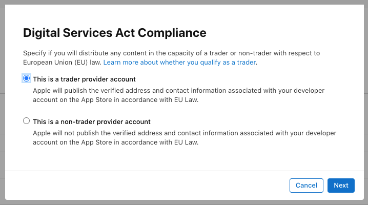

Without recourse to a lawyer, it would seem that if you make any kind of money from your apps you **are** a trader. Even if your apps are free it might be safest to assume you are a trader. 

If you decide you’re NOT a trader, select the non-trader account option and confirm it. That’s the end of the process.
However, if you select the trader account option you’ll be asked to validate your contact information.

### Before you start the process
Apple will ask you to upload copies of documentation to prove the trader name and address is (or is associated with) your developer account name and address.
You should prepare the necessary documentation before you start the Apple verification process.

The documentation I provided was:

- A driving license
- A business letter addressed to me
- My P.O. box address (I used [ukpostbox.com](https://www.ukpostbox.com/))
- A receipt for the purchase my P.O. box that showed my real address and the P.O. box address

### Start the process

Click the **Complete Compliance Requirements** link on the App Store Connect alert, alternatively select the **Business >** **ITC.apps.Navigation.Business** link:

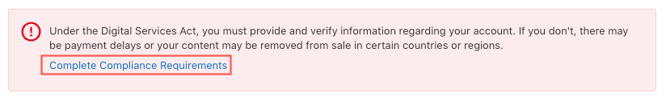

You’ll see the following, where your name and App Store Connect address are shown, along with **1 Action Pending**:

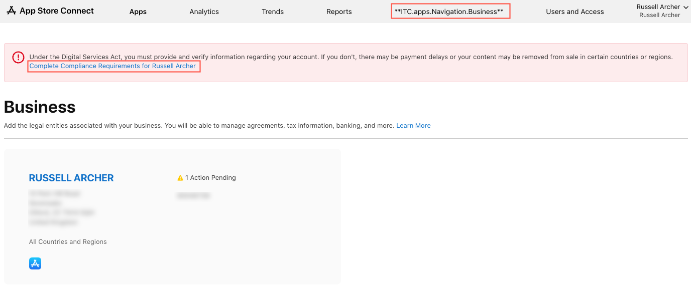

Click the **Complete Compliance Requirements for <your name>** link.

A complete list of all your agreements is displayed. Again, click the **Complete Compliance Requirements** link at the top of the page:

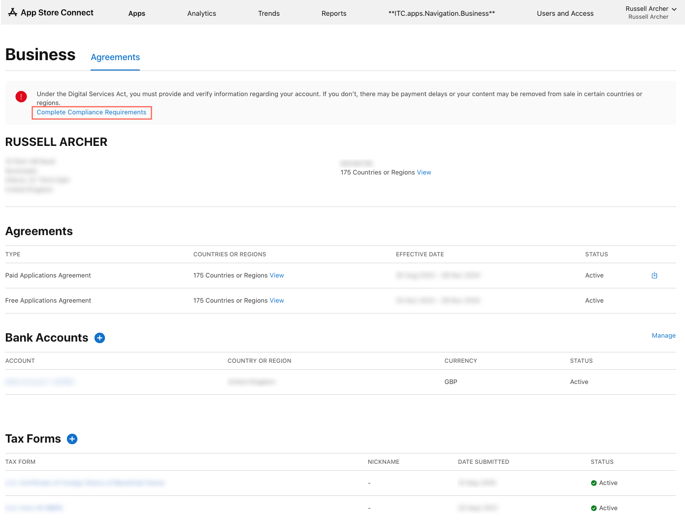

### Confirm you are a trader

Select the **trader** option and click **Next**:

### Confirm contact details

Provide the **address**, **phone** and **email** contact details you want to be displayed on the App Store. If you are using a PO Box instead of your private address, enter the PO Box address here:

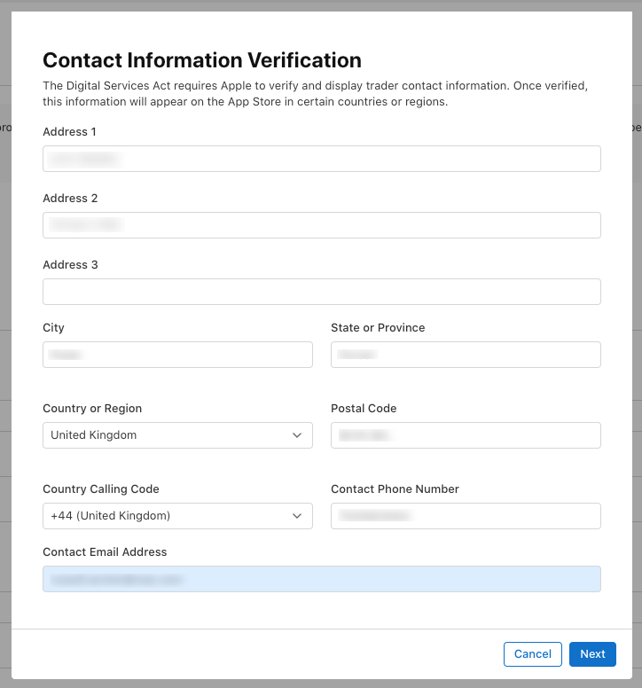

### Verify your email address

You’ll now be asked to verify the email address you provided. Apple will send you an email with a code, which you then have to verify:

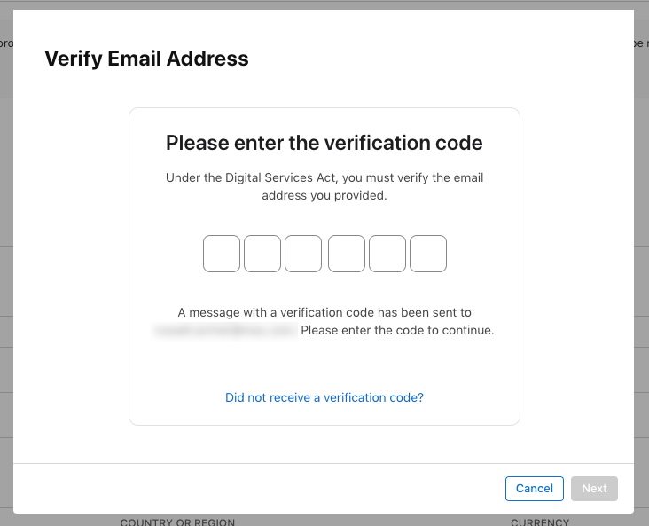

### Verify your phone number

If Apple verified your email, you’ll now be asked to verify the phone number you provided. Apple will send you an SMS with a code, which you then have to verify:

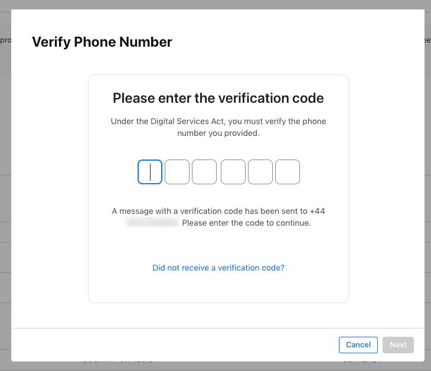

### Verify your name and address

If Apple verifies your phone number, you’ll now have to upload documentation to verify your name and address. According to Apple:

> Acceptable documents include business or legal records. If you’re displaying an alternate address, such as a P.O. Box, you’ll also need to provide documentation that reflects your association with this alternate address (for example, a receipt or bill).
> 

First, choose the language the documents are written in:

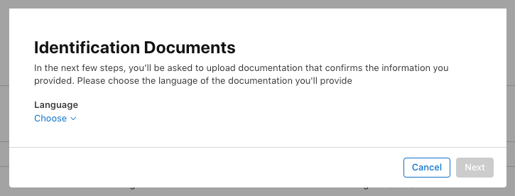

Then upload the document(s) that confirms your **name**:

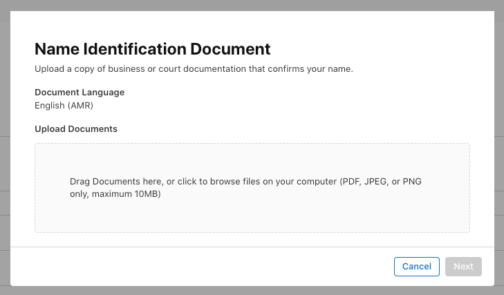

After clicking **Next** you can upload documents that confirm your address. If using a PO Box upload documents that show that your App Store Connect account address is associated with the PO Box (receipts, etc.):

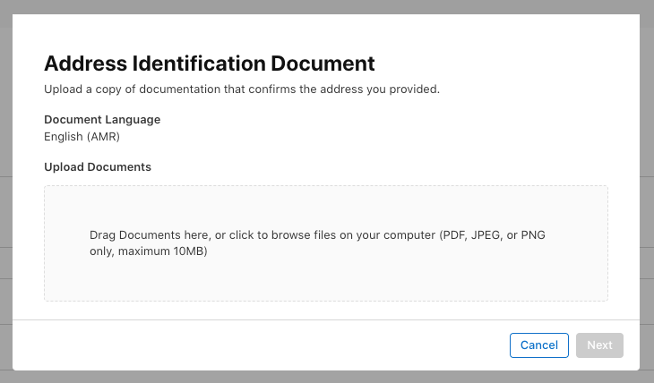

### Summary

Finally, a summary is displayed:

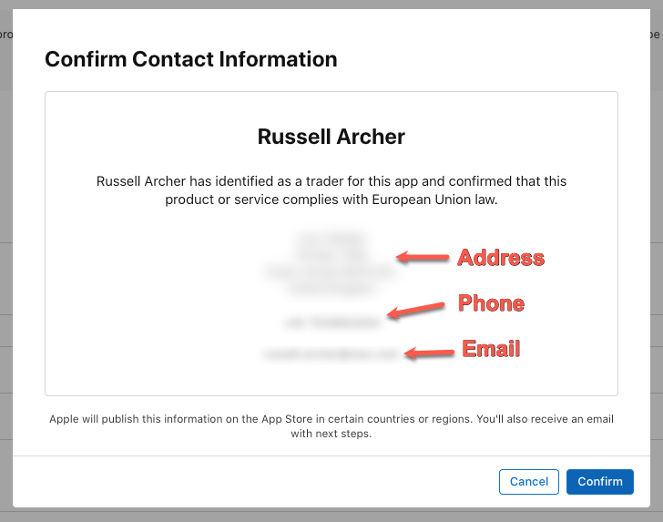

Click **Confirm**.

If you look at your **Agreements** page on App Store Connect you’ll see that a **Compliance** section has been added at the bottom:

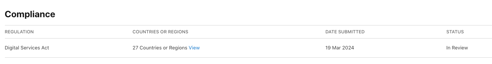

### Email Confirmation

You should now receive a confirmation email from Apple:

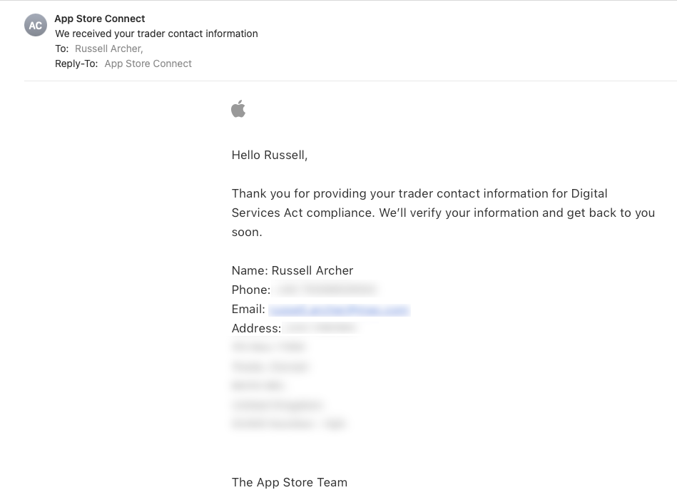

### Next Steps

Now you wait for Apple to review the provided documents! I waited about a week for this process to be completed.

Once Apple have reviewed and verified your documentation you should receive the following email:

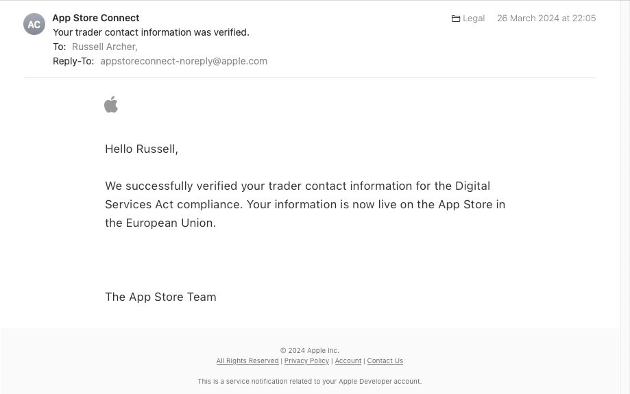
